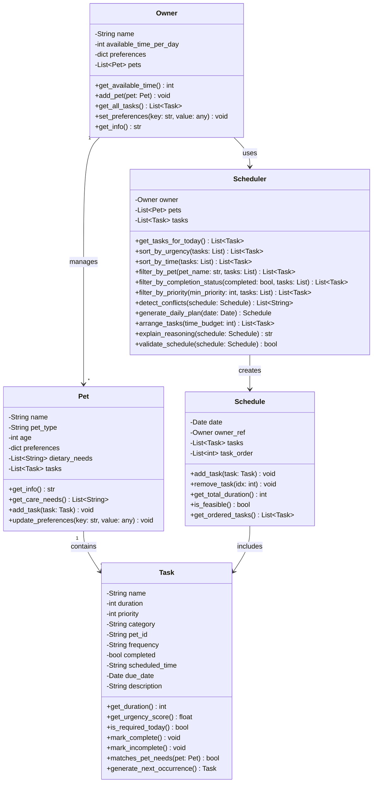

# PawPal+ System Architecture (Final UML)

## Class Relationships

### Owner ↔ Pet (1:Many)
- Owner can manage multiple pets
- Each pet belongs to one owner
- Owner aggregates all pet tasks via `get_all_tasks()`

### Pet ↔ Task (1:Many)
- Each pet has multiple tasks
- Tasks reference their pet via `pet_id`
- Pet.add_task() adds tasks to its task list

### Owner ↔ Scheduler (1:1)
- Each owner has a scheduler instance
- Scheduler operates on owner's pets and tasks

### Scheduler ↔ Schedule (1:Many)
- Scheduler generates multiple schedules over time
- Each schedule is a daily plan created by the scheduler

### Schedule ↔ Task (Many:Many)
- Schedules contain zero or more tasks
- Tasks can appear in multiple schedules across different days

## Phase 4 Algorithmic Methods

### Sorting Algorithms
- `sort_by_urgency(tasks)` - Orders tasks by urgency score (priority × frequency_multiplier)
- `sort_by_time(tasks)` - Orders tasks by scheduled_time in HH:MM format

### Filtering Algorithms  
- `filter_by_pet(pet_name, tasks)` - Returns only tasks for specified pet
- `filter_by_completion_status(completed, tasks)` - Separates completed/incomplete tasks
- `filter_by_priority(min_priority, tasks)` - Returns tasks with priority ≥ threshold

### Conflict Detection
- `detect_conflicts(schedule)` - Identifies tasks scheduled at same time
- Returns warnings for conflicts to prevent double-booking

### Recurring Task Automation
- `Task.generate_next_occurrence()` - Creates next task instance
- Daily tasks → tomorrow, Weekly tasks → 7 days later
- Preserves all task properties (duration, priority, pet_id, etc.)

### Time-Based Scheduling
- `generate_daily_plan(date)` - Assigns HH:MM slots starting at 8:00 AM
- Sequential scheduling based on task duration
- Auto-detects and warns about conflicts

## Design Principles

1. **Separation of Concerns**
   - Business logic in `pawpal_system.py` (Owner, Pet, Task, Schedule, Scheduler)
   - UI in `app.py` (Streamlit presentation)
   - Tests in `tests/test_pawpal.py` (comprehensive coverage)

2. **Single Responsibility**
   - Owner: Manages constraints and pet aggregation
   - Pet: Represents pet characteristics and care needs
   - Task: Tracks individual care activities with urgency
   - Schedule: Builds and validates daily plans
   - Scheduler: Orchestrates scheduling algorithm

3. **Clean Interfaces**
   - Methods accept lists and return modified lists (functional style)
   - Allows chaining: filter → sort → use
   - Easy to unit test independently

4. **Stateful Persistence**
   - Streamlit `st.session_state` persists Owner object across page refreshes
   - Owner changes reflect immediately in UI via `st.rerun()`
